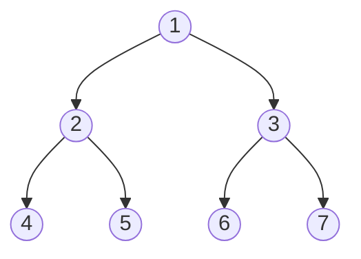
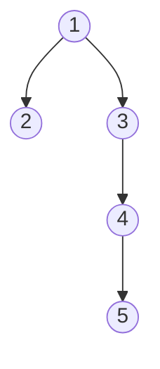

## Bäume
#Datenstruktur 
###### Eigenschaften 
- Jedes Element (Knoten) hat eine endliche, begrenzte Anzahl von Nachfolgern (Kindern), des Elements
- Es gibt ein ausgezeichnetes Element (Wurzel ), das keinen Vorgänger hat
- Elemente ohne Nachfolger heissen Blätter, Elemente mit Vorgänger und Nachfolger(n) innere Knoten

###### Ausprägungen
1)	Vollständiger Binärbaum ^79008f

2) Entarteter Baum ^efd12a

###### Baumarten
-	[[Binärer Suchbaum]]
-	[[AVL-Bäume]]